# hello_world

A new Flutter project.

## Getting Started

This project is a starting point for a Flutter application.

A few resources to get you started if this is your first Flutter project:

- [Lab: Write your first Flutter app](https://docs.flutter.dev/get-started/codelab)
- [Cookbook: Useful Flutter samples](https://docs.flutter.dev/cookbook)

For help getting started with Flutter development, view the
[online documentation](https://docs.flutter.dev/), which offers tutorials,
samples, guidance on mobile development, and a full API reference.

# Practicum Assigment
## 1. Complete Practicum 1 to 5, then document and push to your repository in the form of screenshots of each result along with explanations in the README.md file!

### Practicum 1 : Create New Flutter Project 
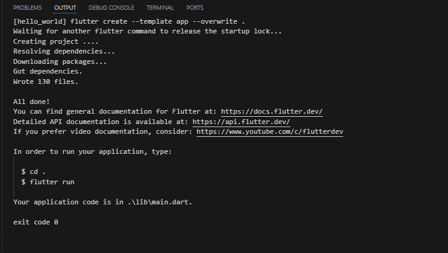

### Practicum 2 : Connecting an Android Device or Emulator
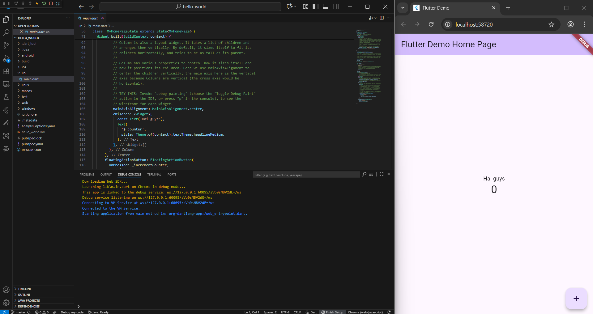

### Practicum 3 : Creating a GitHub Repository and Lab Report
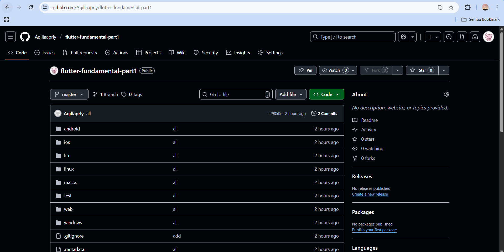

### Practicum 4: Implementing Basic Widgets
#### Text Widget
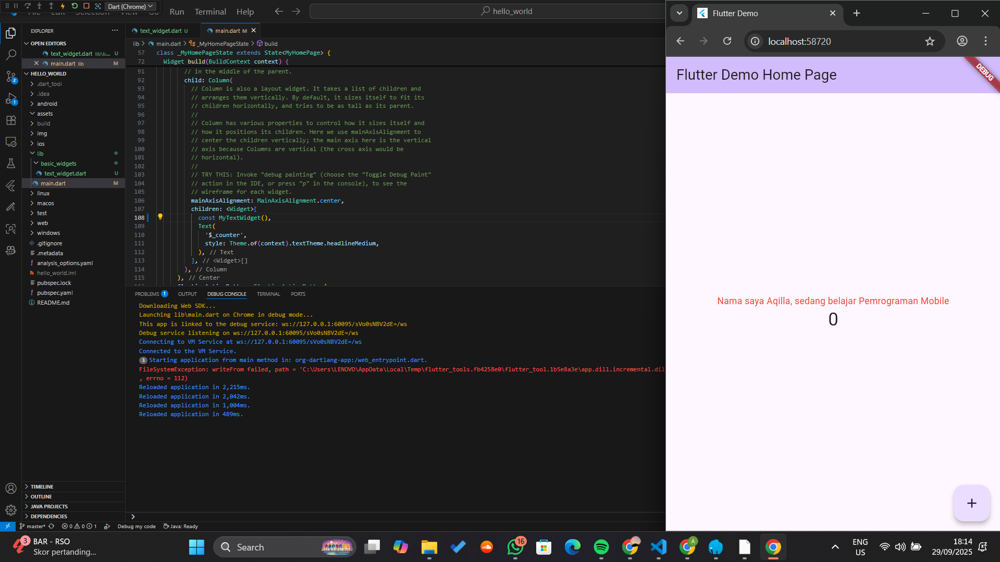
#### Image Widget
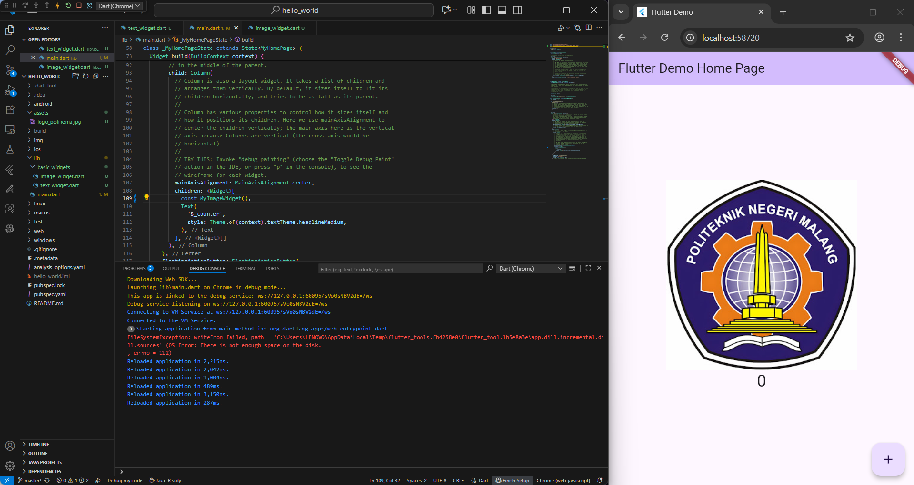

### Practicum 5: 
#### Cupertino Button dan Loading Bar
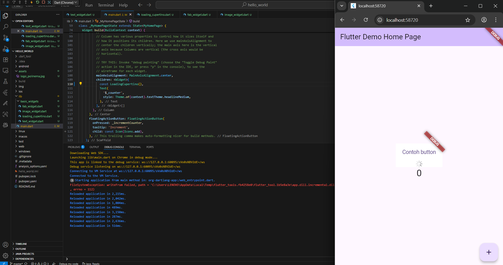

#### Floating Action Button 
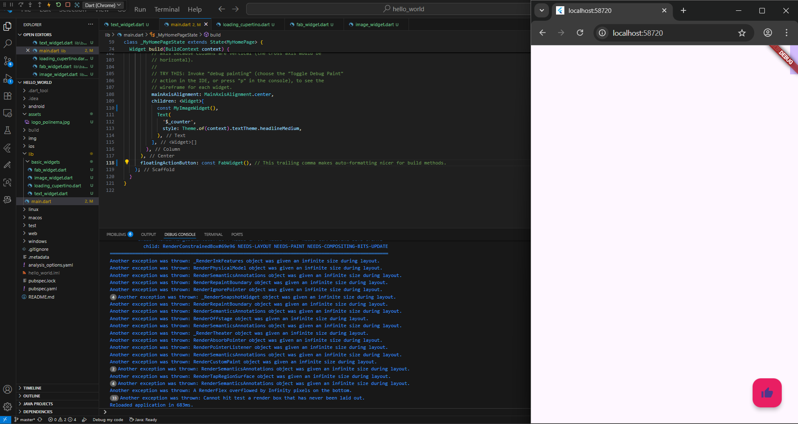

#### Scaffold Widget
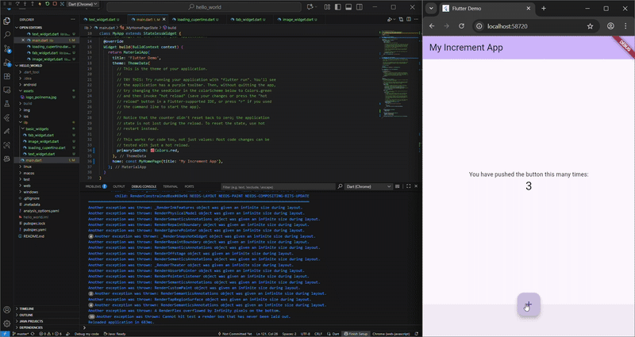

#### Dialog Widget 
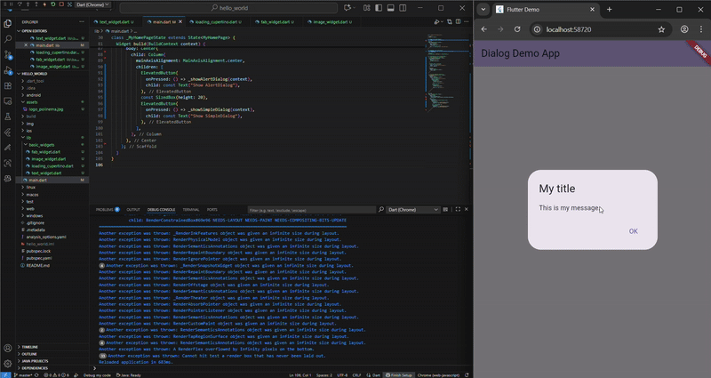

#### Input and Selection Widget
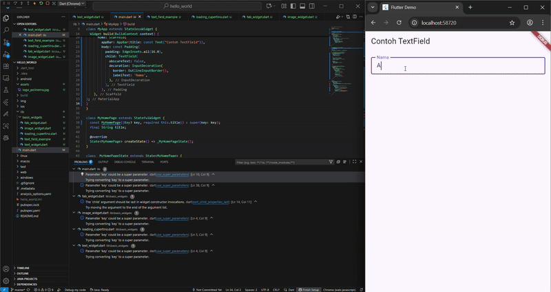

#### Date and Timme Picker
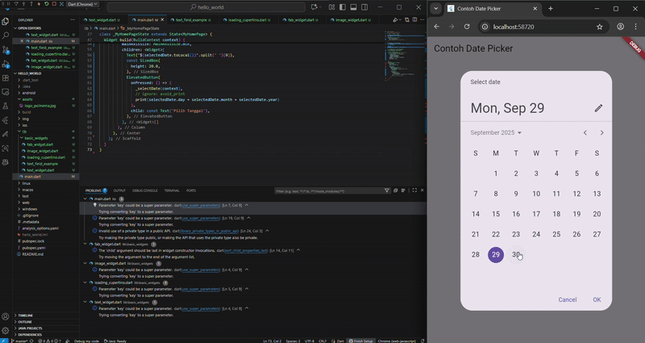

## 2. Complete Practicum 2 and you are required to run the hello_world application on a physical device (Android/iOS) so that you gain experience connecting to a physical device. Capture the result of the application on the device, then make a practicum report in the README.md file.
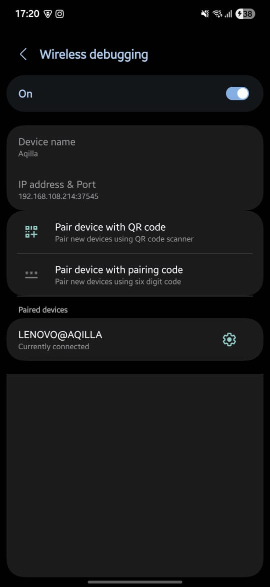

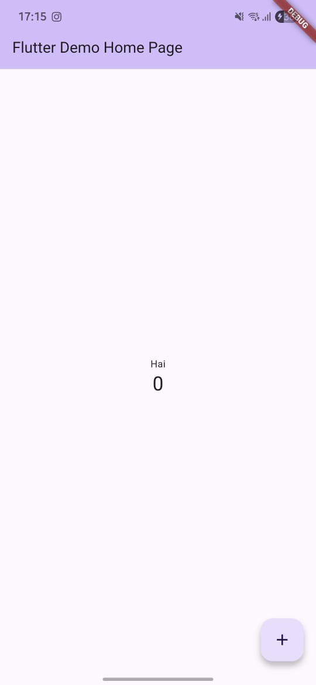

## 3. In Practicum 5, starting from Step 3 to 6, create a separate widget file in the basic_widgets folder, then in the main.dart file only import the widget according to each step!
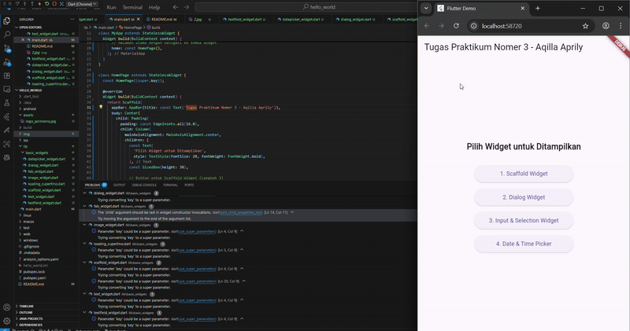

## 4. Complete Codelabs: Your first Flutter app, then make the practicum report and push it to your GitHub repository!
(link github)

## 5. README.md must contain: captures of the final result of each practicum (side-by-side, it can also be a GIF file to show the process of change when there is user interaction) while displaying your Student ID (NIM) and Name as proof of your work.

## 6. Submit in the form of a GitHub repository/commit link to the lecturer as agreed!